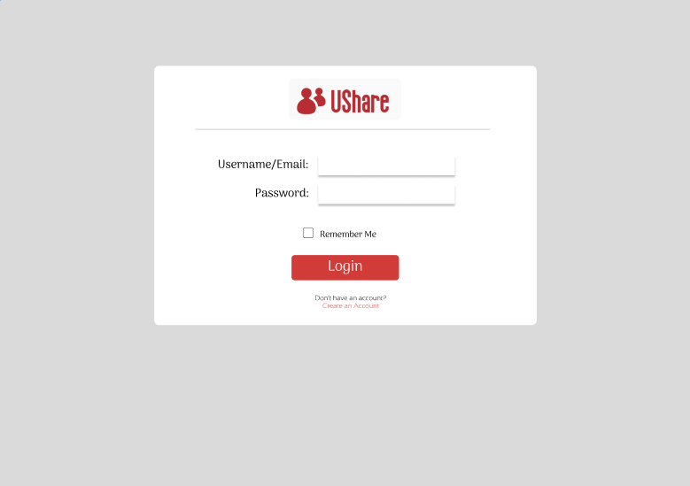
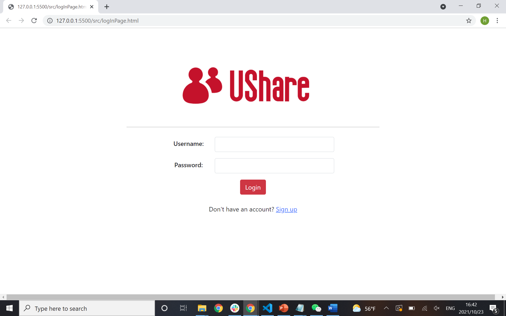
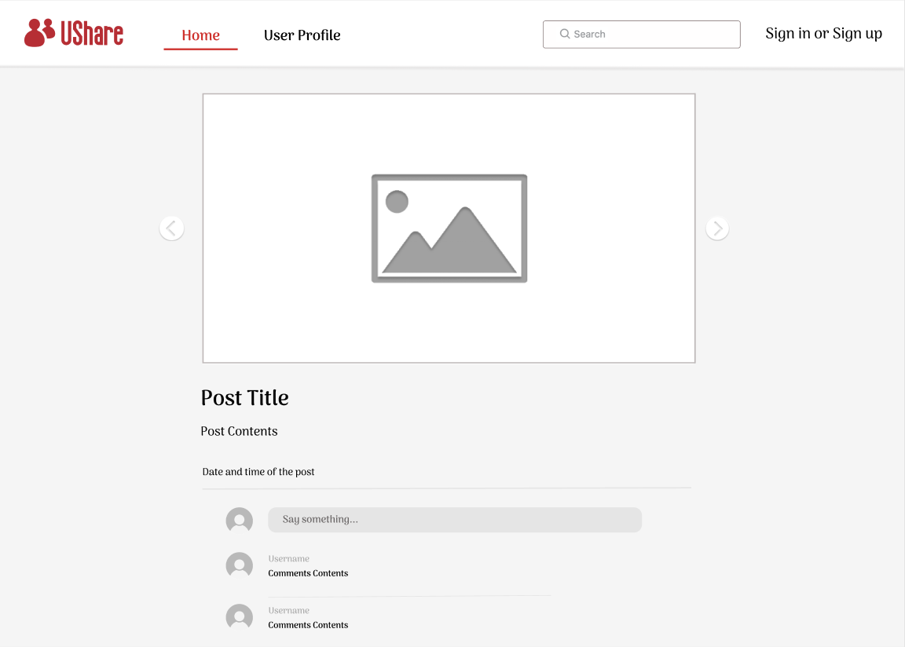
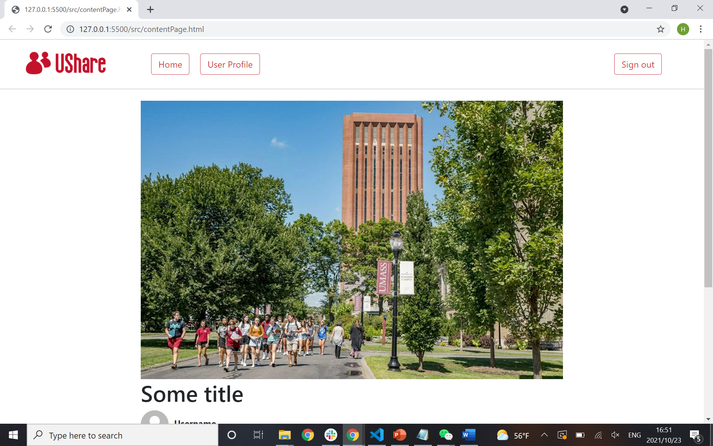
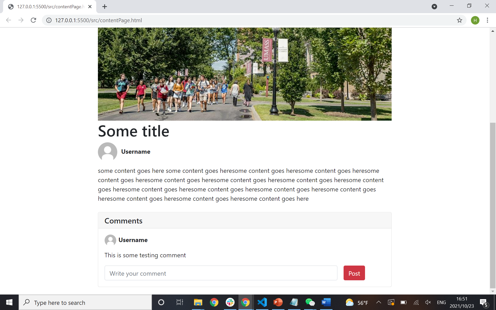
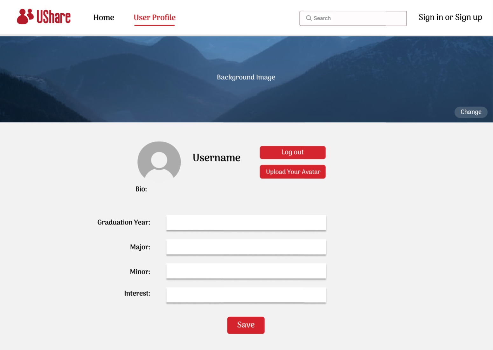
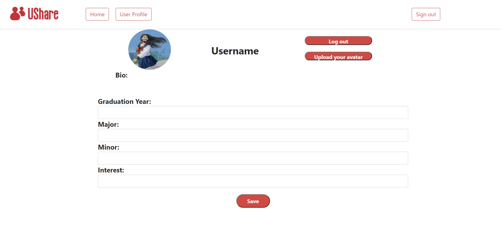
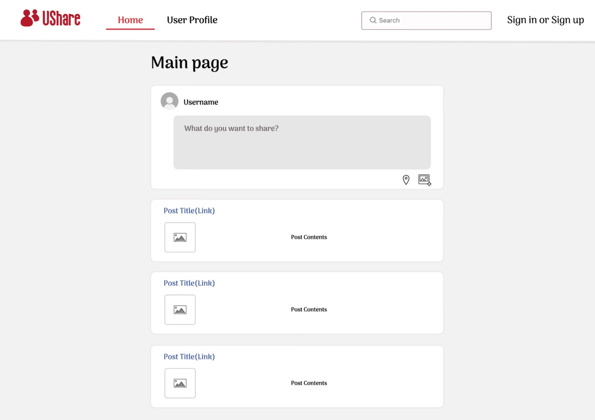
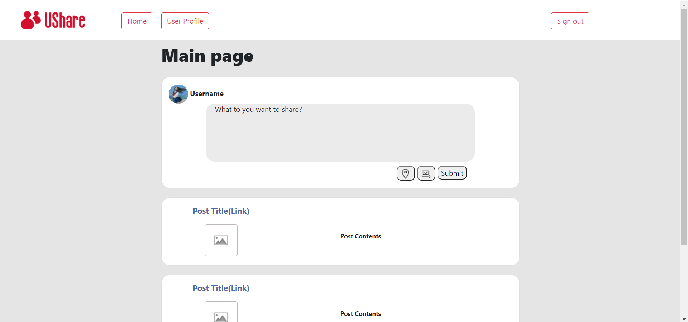

# Milestone1

## Team Name

Team Lambda

## Application Name

UShare

## Team Overview

* Developer 1: Tengzhi Zhuo, username: TengzhiZhuo
* Developer 2: Yi Ding, username: angelading
* Developer 3: Hongxiang Wang, username: hongxiangwan

## Important Data

UShare will implement the following datasets:

* User login Data: Users need to log into our website, so we need to link their email addresses and passwords to their accounts. 
* User profile data: including username, a profile picture, graduation date, major, minor, and interest
* Post data: Users can post text, photos, and locations. Other users can comments under the posts, so we also need to have a set of data for user comments.
* Comment data: including the comment and the information of the user

## Wireframes

### Login Page

This page is for the users to log in to their account.

#### Screenshot

### Content Page

The content page is the page where users can see the full content of the experience shown by another user. At the top of the page, its some buttons to direct the user to other pages. Users can access all the images and the contents of the post in this page. Also, their is a comment section for users to share ideas and thoughts at the bottom. 

#### Screenshot

### User Profile Page
The user profile page is for the user to log their graduation date, major, minor, and interest. They can click on the "Save" button to save their information. They can also upload their profile pictures by clicking on the "Upload Your Avaar" button, and logout from their account by clicking on the "Logout" button. 

#### Screenshot

### Main Page
In the main page, the users can send a post with texts, photos, and locations. Other users can view the posts and they can click on the post title to see all the information.

#### Screenshot

## Breakdown of Labor Division
* Tengzhi Zhuo: compeleted the HTML and CSS of main page and user profile page
* Yi Ding: compeleted wireframes of mainpage, login page, content page, and the userprofile  
* Hongxiang Wang: compeleted the HTML and CSS of user login page and content page
