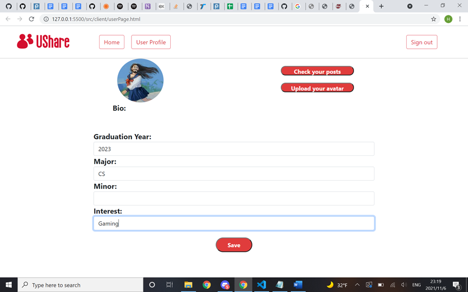
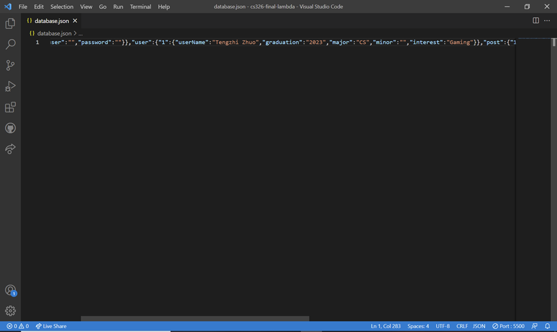
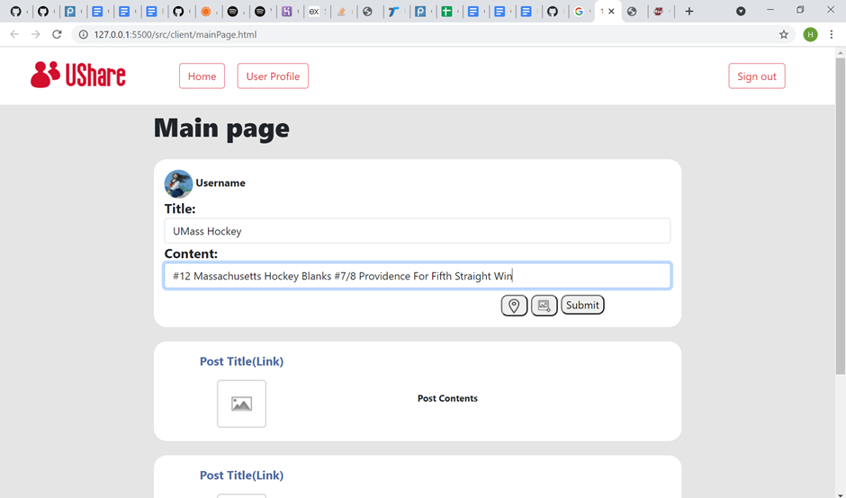
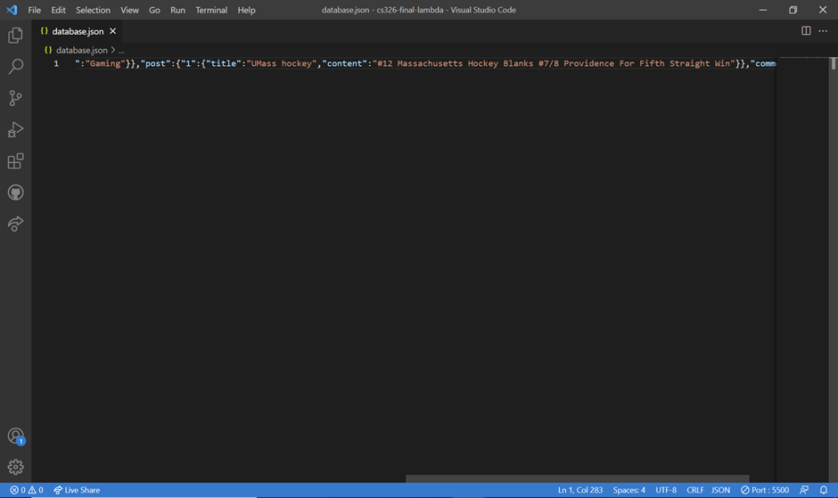
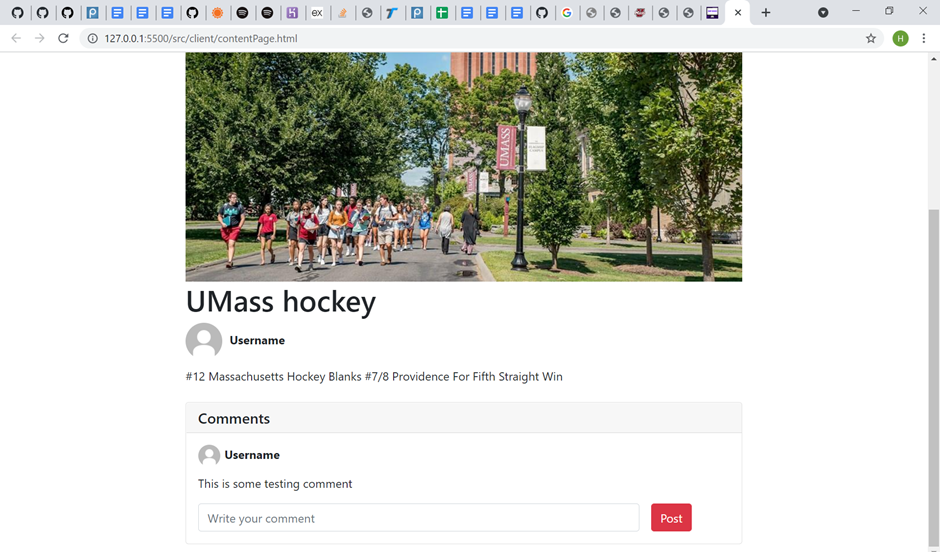

# Milestone2

## Team Name

Team Lambda

## Application Name

UShare

## Team Overview

* Developer 1: Tengzhi Zhuo, username: TengzhiZhuo
* Developer 2: Yi Ding, username: angelading
* Developer 3: Hongxiang Wang, username: hongxiangwan

## API Planning

Based on simple REST principles, the UShare Web API endpoints return JSON metadata about user login, user profile, posts, and comments, directly from the UShare Data Catalogue.

Data resources are accessed via standard HTTPS requests to an API endpoint. Basic routing which is method of the Express `app` object is being used to serve the files. `app.get()` is used to handle GET requests and `app.post` is used to handle POST requests

GET /userPage : Retrieves user page data
Post /userPage/save : Creates user page data identified by User ID

Post /signUp/save : Save user username and password identified by User ID

GET /mainPage : Retrieves main page data, including posts
Post /mainPage/save : Creates main page data identified by Post ID
 
GET /singlePost : Retrieves single post page data, including posts and comments
Post /singlePost/save : Creates single post page data identified by User ID

GET /userPosts : Retrieves user posts data
Post /userPosts/save : Creates user posts data identified by User ID and Post ID

In requests to the Web API and responses from it, you will frequently encounter the following parameters:
| Parameter | Description | Example |
| -------- | -------- | -------- |
| User Id  | The unique number identifying  was assigned to the user after they sign up and it helps identify the user's profile, posts and comments   | 1 |
| Post Id  | The unique number identifying the user posts   | 1 |
| Comment Id  | The unique number identifying the user comments  | 1 |

Web API returns all response data as a JSON object.

Example output: 
{ 
  user: {"1": {username: jack, password: 12345}},
  profile: {"1": {username: jack, "graduation":"2023", "major":"1", "minor":"2", "interest":"4", image: smth.png, post: ["1", "2"]}},
  post: {"1": {image: smth.png, title:abc, content: "Hello World", userid: "1", comment: ["1", "2"]}, "2": {title: "Hello", content: "Hello World", userid: "1"}},
  comment: {"1": {content:, userid: "1"}}
}

## Front-end Implementation

## Heroku Application

url = "https:/  /rocky-tundra-99275.herokuapp.com/";

## Breakdown of Labor Division
* Tengzhi Zhuo: 
* Yi Ding: 
* Hongxiang Wang: 
